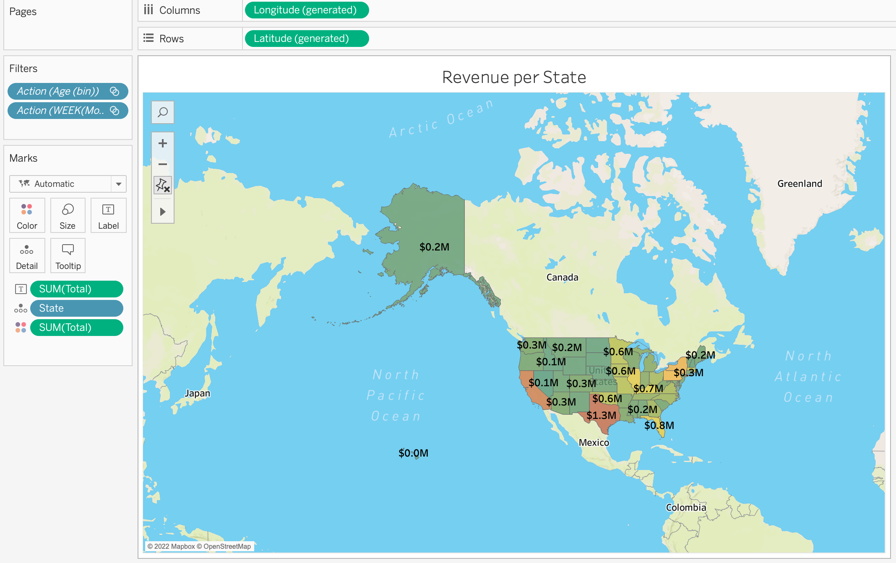

# Tableau-Project
# Customer revenue analysis
## There are 6 tasks to do and then combine the 6 sheets to a dashboard. The dashboard can give us an interactive interface to look at the insight of the data in a visualization way.

1. Revenue per State
We have to use 'total' column as the row and 'State' as the column to create a map chart. The map chart can show us the total revenue for each state.

